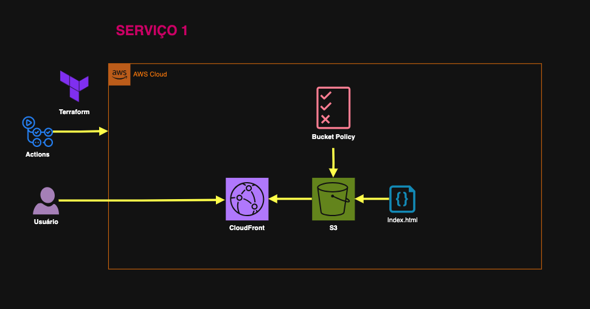
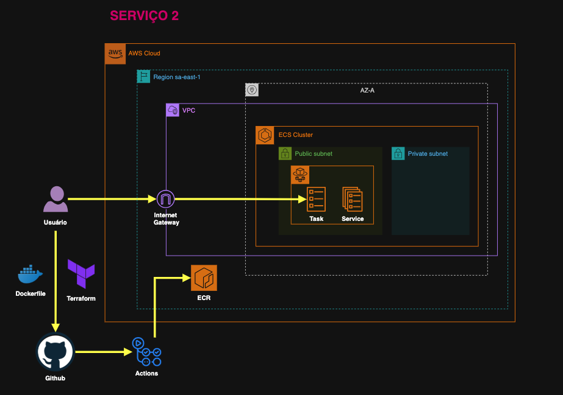

# Desafio Técnico

1 # DreamSquad - Teste Técnico de Engenharia

## Descrição do Desafio
Este projeto é a solução para o **Teste Técnico** proposto pela DreamSquad para a vaga de Engenharia (Cloud/DevOps).

O objetivo é demonstrar habilidades e competências técnicas relacionadas a **Cloud Computing** e **DevOps**, utilizando **Terraform** para provisionar recursos na AWS.


# Desafio 1

# Serviço 1 - Aplicação FrontEnd Estática

Este serviço entrega uma aplicação FrontEnd estática simples, hospedada em um bucket S3 e distribuída via CloudFront para alta performance, segurança e disponibilidade global.

## O que foi implementado (infra):

- **Bucket S3 configurado para hospedagem estática**  
  Com versionamento habilitado e `index.html` como página principal.

- **Distribuição CloudFront com Origin Access Control (OAC)**  
  Atua como CDN, garantindo baixa latência e cache eficiente. O acesso ao bucket S3 é restrito ao CloudFront via OAC, protegendo os arquivos de acesso público direto.

- **Política de bucket restritiva**  
  Permite acesso somente via CloudFront para maior segurança.

- **HTTPS obrigatório e compressão ativada**  
  Todas as requisições são redirecionadas para HTTPS e os arquivos são entregues comprimidos para otimizar a transferência.

## O que foi implementado (app):

Uma página simples com:

- **HTML (`index.html`)**: estrutura básica com cabeçalho, seção principal e rodapé. Inclui um botão que mostra/esconde a hora local.

- **CSS (`style.css`)**: layout responsivo e visual moderno com cores suaves, animações e transições.

- **JavaScript (`script.js`)**: atualiza automaticamente o ano no rodapé e controla o botão para mostrar/esconder a hora local em tempo real.




# Serviço 2 - Aplicação Back-end em Flask

Este serviço entrega uma aplicação back-end simples desenvolvida em Python com Flask, containerizada com Docker para facilitar o deploy.

## O que foi implementado (app):

- **API Flask básica**  
  Contém duas rotas principais:  
  - `/health`: retorna status `healthy` para monitoramento da saúde da aplicação.  
  - `/`: retorna uma mensagem simples "Hello from Flask!".

- **Execução**  
  A aplicação escuta na porta `5000` em todas as interfaces (`0.0.0.0`).

## Dockerfile

- **Imagem base**: Python Alpine, para manter a imagem leve.  
- **Dependências instaladas**: ferramentas de compilação e bibliotecas necessárias para o Flask e suas dependências.  
- **Usuário não-root**: cria e utiliza o usuário `appuser` para maior segurança.  
- **Configuração do ambiente**: variáveis para rodar o Flask em modo desenvolvimento com as configurações corretas.  
- **Exposição da porta 5000**: para permitir acesso externo à aplicação.  
- **Healthcheck configurado**: verifica a rota `/health` a cada 30 segundos para garantir que o container está saudável.  
- **Comando de execução**: `flask run`.

## O que foi implementado (infra):

- **VPC (Virtual Private Cloud)**  
  - Rede privada isolada com CIDR 10.0.0.0/16.  
  - 3 zonas de disponibilidade (AZs) para alta disponibilidade.  
  - Subnets públicas e privadas configuradas.  
  - Gateway de internet criado para permitir acesso externo.  
  - NAT Gateway desabilitado (sem acesso à internet para subnets privadas).

- **ECR (Elastic Container Registry)**  
  - Repositório para armazenar a imagem Docker do backend.  
  - Política de ciclo de vida para manter apenas as últimas 3 imagens com tag “v*”, removendo imagens antigas automaticamente.  
  - Permissões configuradas para leitura e escrita pelo usuário atual.

- **ECS (Elastic Container Service) Fargate**  
  - Cluster ECS criado para executar containers sem necessidade de gerenciar servidores.  
  - Serviço `backend-service` configurado com:  
    - 1 task rodando a imagem do ECR com a tag `latest`.  
    - CPU e memória definidos via variáveis.  
    - Mapeamento da porta 5000 TCP.  
    - Variáveis de ambiente para configurar o Flask.  
    - Health check na rota `/health`.  
    - Logs enviados para o CloudWatch Logs.

- **Security Group**  
  - Permite acesso externo na porta 5000 do container.  
  - Permite todo tráfego de saída.

- **CloudWatch Logs**  
  - Grupo de logs configurado para armazenar logs do ECS.  
  - Retenção configurada para 30 dias.

---

Essa infraestrutura oferece alta disponibilidade, segurança e monitoramento para a aplicação backend, facilitando o deploy contínuo com imagens Docker versionadas e orquestradas no ECS Fargate.



## Serviço 3 - Lambda para Inserção Diária de Arquivo no S3

Este serviço executa uma rotina diária que insere um arquivo no bucket S3.  
O nome do arquivo gerado inclui a data e hora exata da execução da rotina.

---

### O que foi implementado (app):

- **Lambda em Python** que:
  - Recebe eventos agendados do EventBridge.
  - Gera um arquivo de texto com conteúdo que inclui data/hora, nome da função Lambda e request ID.
  - Salva o arquivo no bucket S3 definido na variável de ambiente `BUCKET_NAME`.
  - Loga informações detalhadas do evento recebido e do processo de upload.
  - Trata erros específicos de cliente AWS (ClientError) e erros inesperados, retornando status HTTP apropriados.

---


### O que foi implementado (infra):

- **S3 Bucket**
  - Bucket S3 criado para armazenar os arquivos diários.
  - Versionamento habilitado para manter versões dos arquivos.
  - Regra de ciclo de vida para expirar objetos após 30 dias.
  - Controle de propriedade de objetos configurado para segurança.
  - Tagging aplicada para organização.

- **Função Lambda**
  - Função Lambda criada com código Python para gerar e inserir arquivos.
  - Variáveis de ambiente configuradas para informar o bucket e região.
  - Configuração de timeout e memória conforme variáveis.
  - Retenção dos logs no CloudWatch configurada.
  - Permissão IAM concedida para Lambda acessar o bucket S3 (ações: PutObject, GetObject, ListBucket).

- **EventBridge Schedule**
  - Regra agendada para disparar a Lambda diariamente às 10:00 AM no fuso "America/Sao_Paulo".
  - Permissões Lambda configuradas para permitir execução pela regra do EventBridge.

---

### Variáveis importantes:

- `BUCKET_NAME`: nome do bucket S3 onde os arquivos serão armazenados.
- `schedule_expression`: expressão cron para disparar a Lambda (exemplo: `"cron(0 13 * * ? *)"` para 10:00 AM horário de São Paulo).
- `lambda_timeout`, `lambda_memory_size`: configuração da função Lambda.

---

### Como funciona:

1. O EventBridge dispara o evento de agendamento diariamente no horário configurado.
2. A função Lambda é executada, gera um arquivo de texto com timestamp no nome.
3. O arquivo é inserido no bucket S3 com metadados customizados.
4. Logs são gerados para monitoramento no CloudWatch.
5. Arquivos com mais de 30 dias são automaticamente removidos pelo lifecycle rule do S3.

---

Essa solução garante uma rotina automatizada e confiável para inserção diária de arquivos no S3, com monitoramento e controle de acesso adequados.


## 📂 Estrutura do Projeto

```bash
sioeuzal
├── 01-frontend               # Frontend estático
│   ├── app
│   │   └── src              # Código fonte do frontend
│   │       ├── index.html
│   │       ├── script.js
│   │       └── style.css
│   └── infra                # Infraestrutura Terraform para frontend
│       ├── data.tf
│       ├── inventories
│       │   └── dev
│       │       └── terraform.tfvars
│       ├── locals.tf
│       ├── main.tf
│       ├── outputs.tf
│       ├── providers.tf
│       ├── terraform.tfstate
│       ├── terraform.tfstate.backup
│       └── variables.tf
├── 02-backend               # Backend Flask containerizado
│   ├── app
│   │   ├── Dockerfile
│   │   ├── requirements.txt
│   │   └── src
│   │       └── app.py
│   └── infra                # Infraestrutura Terraform para backend
│       ├── data.tf
│       ├── inventories
│       │   └── dev
│       │       └── terraform.tfvars
│       ├── locals.tf
│       ├── main.tf
│       ├── outputs.tf
│       ├── providers.tf
│       ├── terraform.tfstate
│       ├── terraform.tfstate.backup
│       └── variables.tf
├── 03-cronjob               # Lambda rotina diária para inserir arquivo no S3
│   ├── app
│   │   └── src
│   │       └── lambda_function.py
│   └── infra                # Infraestrutura Terraform para cronjob
│       ├── data.tf
│       ├── inventories
│       │   └── dev
│       │       └── terraform.tfvars
│       ├── locals.tf
│       ├── main.tf
│       ├── outputs.tf
│       ├── providers.tf
│       ├── terraform.tfstate
│       ├── terraform.tfstate.backup
│       └── variables.tf
└── README.md                # Documentação geral do projeto
